# Liveasy

1. **Select Language Screen:** You have 2 options either English or Hindi.
   

     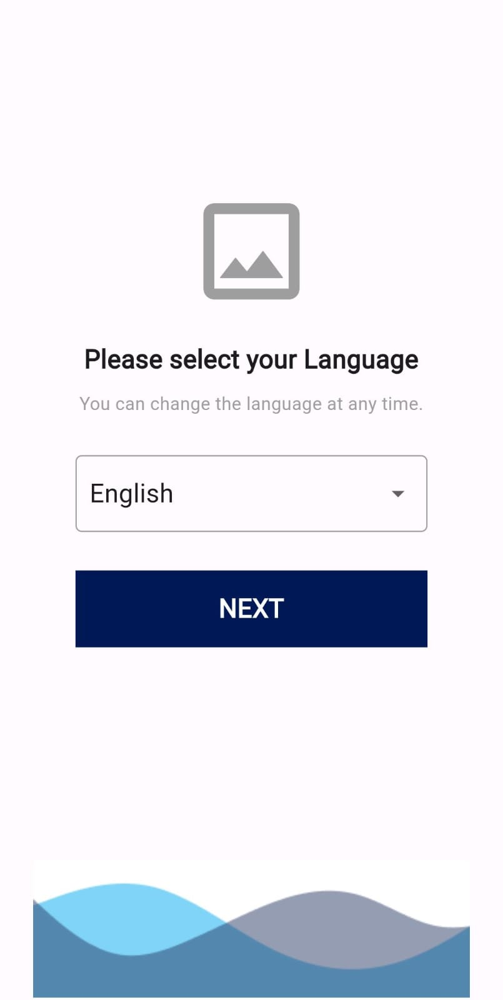
     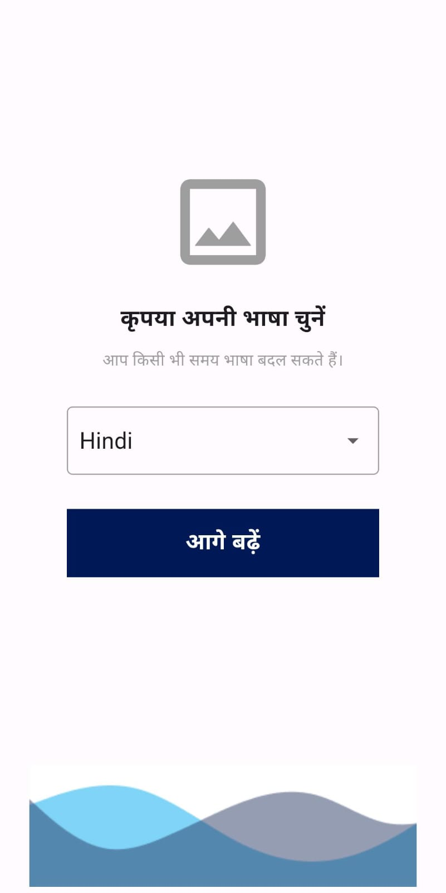
   

   Based on the selection made, the content on the UI will change accordingly.

2. **Verify Mobile Screen:** Enter your mobile number for verification and then press continue. Once the number is verified, an OTP will be sent for logging in.
   

     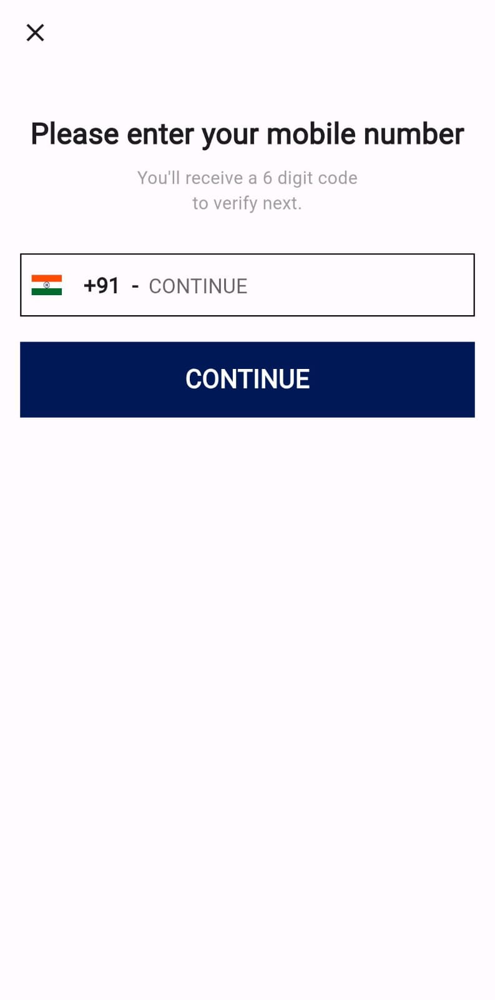
     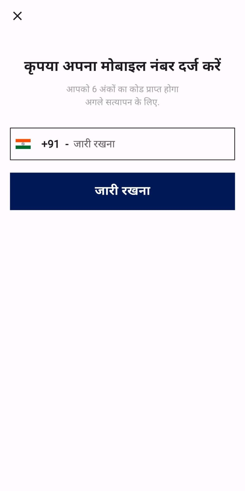
   

3. **Enter OTP Screen:** After receiving the OTP, enter it into the app to validate it. If the OTP is correct, you will be logged in. If OTP is not received, you can request another OTP from the Resend OTP option.
   

     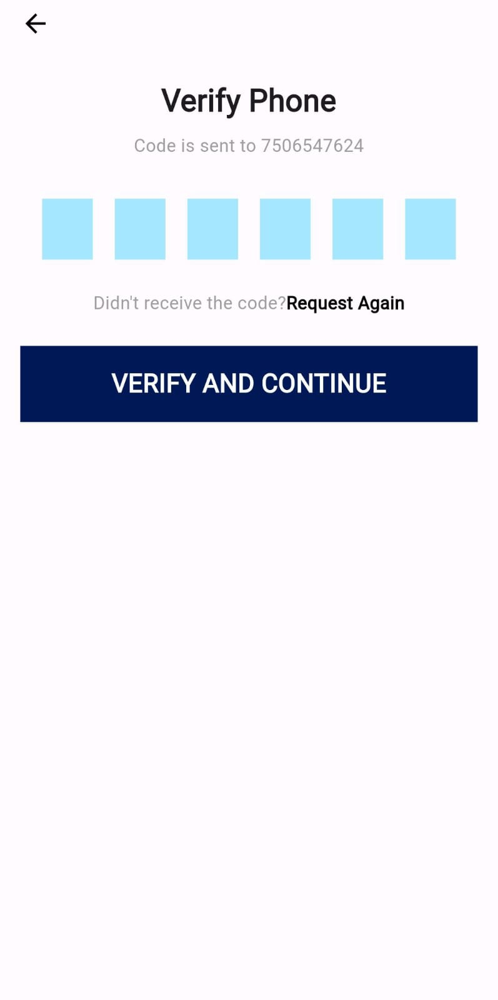
     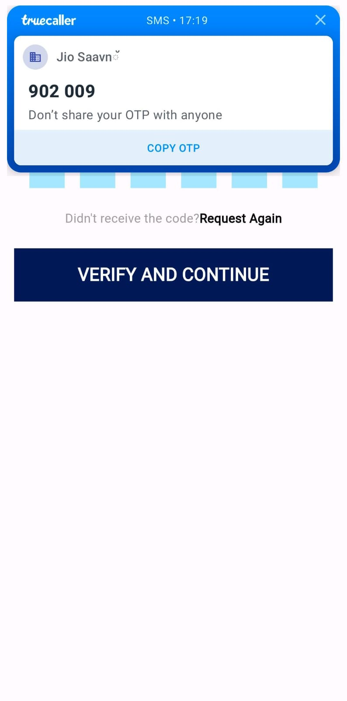
   

   

     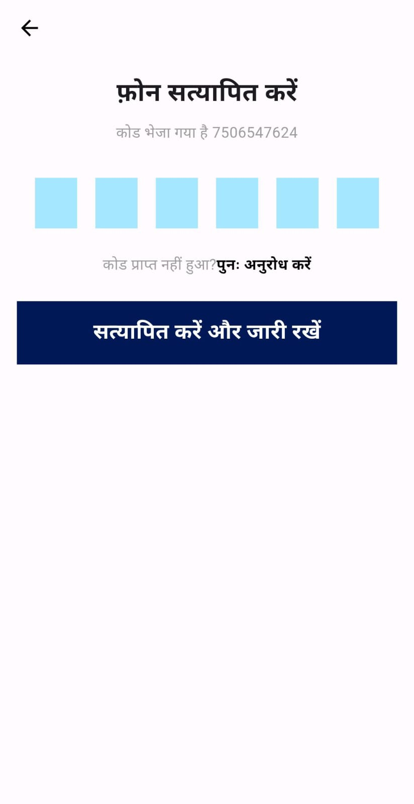
     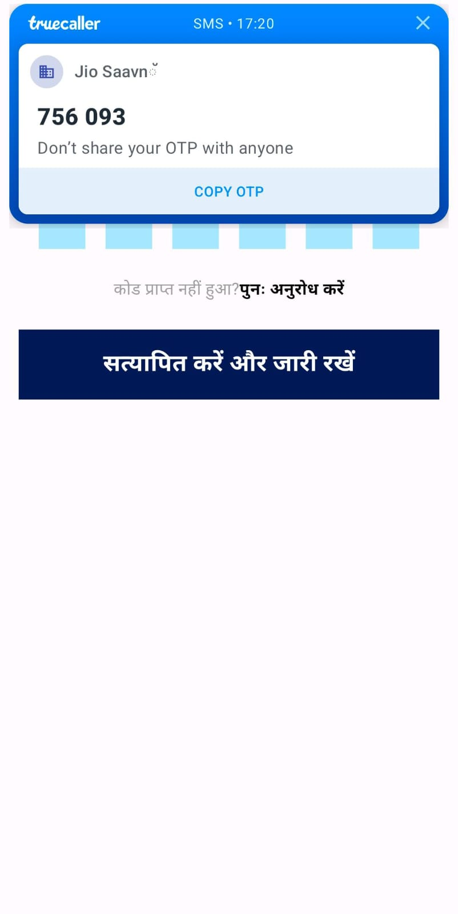
   

4. **Home Screen:** Here there are 2 options displayed as Shipper or Transporter. You will need to select any one of the options which will be reflected on the UI of the app.
   

     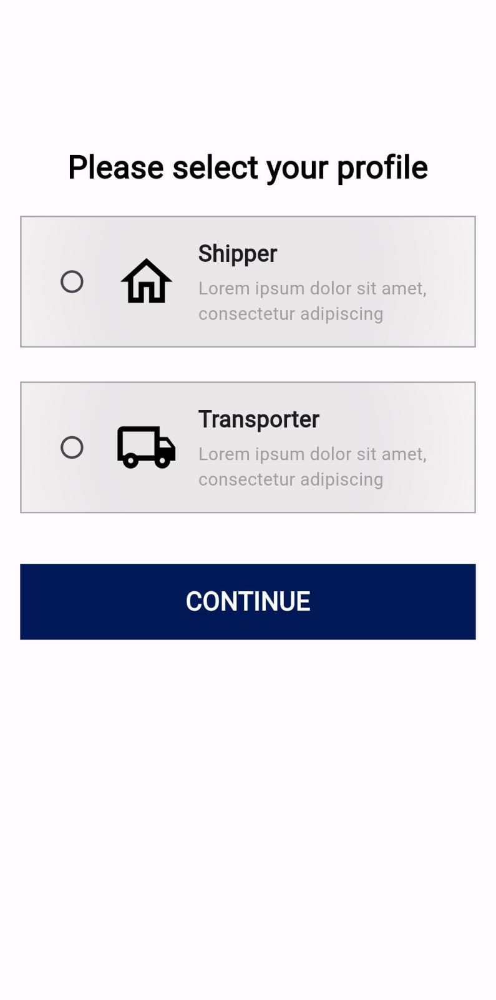
     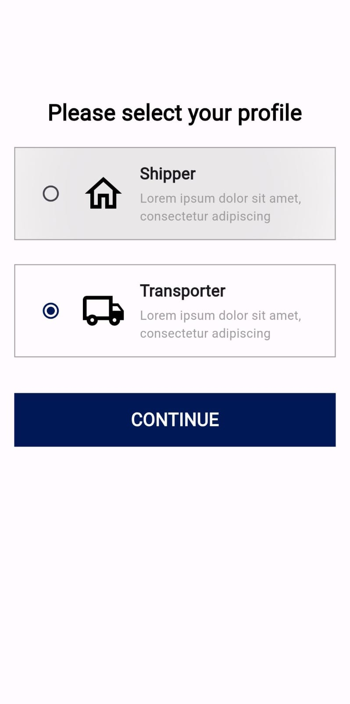
   

   

     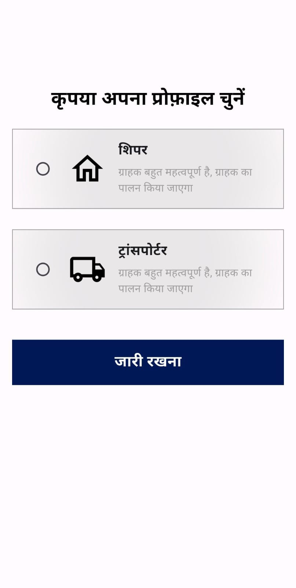
     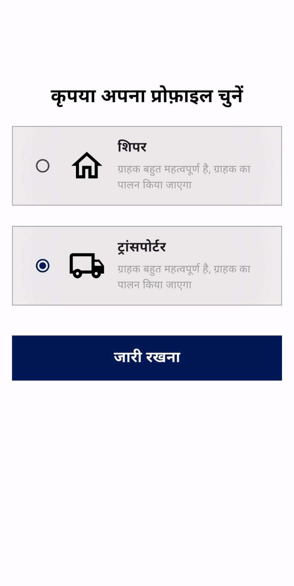
   

